# ⚡ VideoFetch
<p align="center">
  
</p>

A modern, responsive web application for downloading publicly accessible videos from supported platforms. Built with **React + Vite** (frontend) and **Node.js + Express** (backend), powered by [yt-dlp](https://github.com/yt-dlp/yt-dlp).

---

## Features

- 🎬 **Video metadata extraction** — title, thumbnail, duration, uploader
- 📦 **Multiple format options** — MP4, WebM, audio-only, various resolutions
- ⬇️ **Download progress tracking** — real-time byte counter and progress bar
- 📋 **Clipboard auto-paste** — detects video URLs on your clipboard
- 🗂️ **Download history** — stored locally via localStorage
- 🖱️ **Drag & drop** — drop a URL directly into the input
- 🛡️ **DRM platform blocking** — Netflix, Disney+, etc. are blocked
- 🚦 **Rate limiting** — prevents API abuse
- 📱 **Mobile-friendly** — fully responsive design
- 🌑 **Dark futuristic theme** — glassmorphism, neon accents, pitch black background

---

## Prerequisites

- **Node.js** ≥ 18
- **yt-dlp** installed and available on PATH
  ```bash
  # Install yt-dlp
  pip install yt-dlp
  # or on Windows
  winget install yt-dlp
  ```

---

## 🏗️ System Architecture Diagram

```mermaid
flowchart LR
    %% Color Styling
    classDef client fill:#1e40af,stroke:#3b82f6,color:#fff;
    classDef middleware fill:#6b21a8,stroke:#a855f7,color:#fff;
    classDef decision fill:#b45309,stroke:#f59e0b,color:#fff;
    classDef engine fill:#0e7490,stroke:#06b6d4,color:#fff;
    classDef success fill:#047857,stroke:#10b981,color:#fff;
    classDef danger fill:#b91c1c,stroke:#ef4444,color:#fff;
    classDef storage fill:#4338ca,stroke:#6366f1,color:#fff;

    USER["🌐 Web Client<br/>(React + Vite)"]:::client
    CLIP["📋 Auto-Paste"]:::client
    HIST["🗂️ LocalStorage"]:::storage

    MIDDLEWARE["🛡️ Security & Rate Limiter"]:::middleware
    CHECK{"🚫 Allowed?"}:::decision
    REJECT["🔴 403 Blocked<br/>(DRM / Restricted)"]:::danger
    ROUTER["⚡ Express Router<br/>(/api/video)"]:::middleware

    DISPATCH{"🔍 Dispatcher"}:::decision

    CUSTOM["🔑 Custom Scraper<br/>(Token & Deobfuscation Engine)"]:::engine
    YTDLP["🐍 yt-dlp CLI Engine"]:::engine

    TRIM{"✂️ Trim?"}:::decision

    STREAM["🚀 Direct Stream"]:::engine
    PROXY["🎬 Range Proxy & FFmpeg"]:::engine

    OK["✅ 200 Delivered"]:::success

    %% Connections
    USER --> MIDDLEWARE
    CLIP --> USER
    HIST <--> USER

    MIDDLEWARE --> CHECK
    CHECK -->|Blocked| REJECT
    CHECK -->|Allowed| ROUTER

    ROUTER --> DISPATCH
    DISPATCH -->|Custom Extractors| CUSTOM
    DISPATCH -->|Generic / Public Sites| YTDLP

    CUSTOM --> TRIM
    YTDLP --> TRIM

    TRIM -->|Full Video| STREAM
    TRIM -->|Partial Range| PROXY

    STREAM --> OK
    PROXY --> OK
```



## Project Structure

```
videofetch/
├── client/                     # React frontend (Vite)
│   ├── public/
│   │   ├── VideoFetch.png      # Original README hero banner
│   │   └── logo.png            # App logo icon
│   ├── src/
│   │   ├── components/
│   │   │   ├── Disclaimer.jsx
│   │   │   ├── DownloadHistory.jsx
│   │   │   ├── DownloadProgress.jsx
│   │   │   ├── Footer.jsx
│   │   │   ├── FormatSelector.jsx
│   │   │   ├── Header.jsx
│   │   │   ├── Settings.jsx
│   │   │   ├── SideNavBar.jsx
│   │   │   ├── URLInput.jsx
│   │   │   ├── VideoPreview.jsx
│   │   │   └── VideoTrimmer.jsx
│   │   ├── hooks/
│   │   │   ├── useAppSettings.js
│   │   │   ├── useClipboard.js
│   │   │   └── useDownloadHistory.js
│   │   ├── utils/
│   │   │   ├── api.js
│   │   │   ├── formatters.js
│   │   │   └── validators.js
│   │   ├── App.css
│   │   ├── App.jsx
│   │   ├── index.css
│   │   └── main.jsx
│   ├── index.html
│   ├── package.json
│   └── vite.config.js
├── server/                     # Express backend
│   ├── src/
│   │   ├── middleware/
│   │   │   ├── rateLimiter.js
│   │   │   └── validator.js
│   │   ├── routes/
│   │   │   └── video.js
│   │   ├── services/
│   │   │   └── ytdlp.js
│   │   ├── utils/
│   │   │   ├── blocklist.js
│   │   │   └── helpers.js
│   │   └── index.js
│   ├── .env.example
│   └── package.json
├── README.md
└── package.json
```

---

## Quick Start

### 1. Clone and install dependencies

```bash
npm run install-all
```

### 2. Configure environment

```bash
cd server
cp .env.example .env
# Edit .env if needed (defaults work for local dev)
```

### 3. Start development server

```bash
npm run dev
```

The frontend runs at `http://localhost:5173` and proxies API requests to the backend at `http://localhost:3001`.

---

## Environment Variables

| Variable | Default | Description |
|---|---|---|
| `PORT` | `3001` | Backend server port |
| `CORS_ORIGIN` | `http://localhost:5173` | Allowed CORS origin |
| `RATE_LIMIT_WINDOW_MS` | `900000` | Rate limit window (15 min) |
| `RATE_LIMIT_MAX` | `50` | Max requests per window |
| `YTDLP_PATH` | `yt-dlp` | Path to yt-dlp binary |

---

## Deployment

### Fullstack → Render

1. Push code to your GitHub repo
2. Connect repository on [Render](https://render.com)
3. Set **Build Command**: `npm run build`
4. Set **Start Command**: `npm start`

---

## Security & Legal

- ⚠️ Only download content you have the rights to access
- 🛡️ DRM-protected platforms (Netflix, Disney+, HBO Max, etc.) are blocked
- 🚦 Rate limiting is enabled by default (50 req / 15 min)
- 🔒 Helmet security headers are applied
- No files are stored permanently on the server

---

## Tech Stack

| Layer | Technology |
|---|---|
| Frontend | React 18, Vite 5, Tailwind CSS |
| Backend | Node.js, Express 4 |
| Video Engine | yt-dlp (CLI) + FFmpeg |
| Styling | Pitch black background, glassmorphism, dynamic theme accents |
| State | React hooks + localStorage |

---

## License

This project is licensed under the [MIT License](LICENSE.md) — use responsibly.
