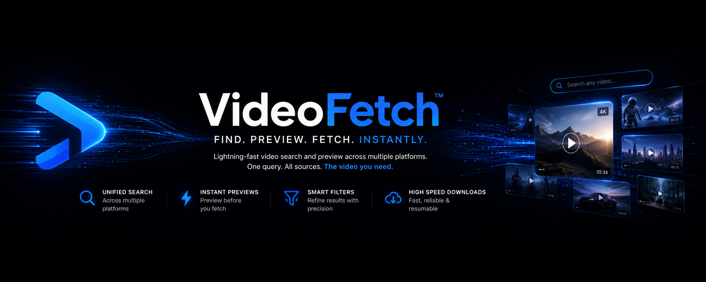
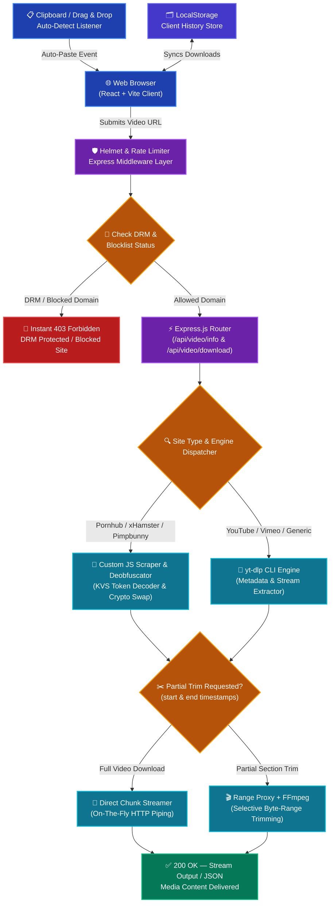

# ⚡ VideoFetch
<p align="center">
  
</p>

A modern, responsive web application for downloading publicly accessible videos from supported platforms. Built with **React + Vite** (frontend) and **Node.js + Express** (backend), powered by [yt-dlp](https://github.com/yt-dlp/yt-dlp).

![Dark futuristic theme with glassmorphic UI]

---

## Features

- 🎬 **Video metadata extraction** — title, thumbnail, duration, uploader
- 📦 **Multiple format options** — MP4, WebM, audio-only, various resolutions
- ⬇️ **Download progress tracking** — real-time byte counter and progress bar
- 📋 **Clipboard auto-paste** — detects video URLs on your clipboard
- 🗂️ **Download history** — stored locally via localStorage
- 🖱️ **Drag & drop** — drop a URL directly into the input
- 🛡️ **DRM platform blocking** — Netflix, Disney+, etc. are blocked
- 🚦 **Rate limiting** — prevents API abuse
- 📱 **Mobile-friendly** — fully responsive design
- 🌑 **Dark futuristic theme** — glassmorphism, neon accents, particle background

---

## Prerequisites

- **Node.js** ≥ 18
- **yt-dlp** installed and available on PATH
  ```bash
  # Install yt-dlp
  pip install yt-dlp
  # or on Windows
  winget install yt-dlp
  ```

---

## 🏗️ System Architecture Diagram



## Project Structure

```
videofetch/
├── client/                     # React frontend (Vite)
│   ├── public/
│   ├── src/
│   │   ├── components/
│   │   │   ├── Disclaimer.jsx
│   │   │   ├── DownloadHistory.jsx
│   │   │   ├── DownloadProgress.jsx
│   │   │   ├── Footer.jsx
│   │   │   ├── FormatSelector.jsx
│   │   │   ├── Header.jsx
│   │   │   ├── ParticleBackground.jsx
│   │   │   ├── URLInput.jsx
│   │   │   └── VideoPreview.jsx
│   │   ├── hooks/
│   │   │   ├── useClipboard.js
│   │   │   └── useDownloadHistory.js
│   │   ├── utils/
│   │   │   ├── api.js
│   │   │   ├── formatters.js
│   │   │   └── validators.js
│   │   ├── App.css
│   │   ├── App.jsx
│   │   ├── index.css
│   │   └── main.jsx
│   ├── index.html
│   ├── package.json
│   └── vite.config.js
├── server/                     # Express backend
│   ├── src/
│   │   ├── middleware/
│   │   │   ├── rateLimiter.js
│   │   │   └── validator.js
│   │   ├── routes/
│   │   │   └── video.js
│   │   ├── services/
│   │   │   └── ytdlp.js
│   │   ├── utils/
│   │   │   ├── blocklist.js
│   │   │   └── helpers.js
│   │   └── index.js
│   ├── .env.example
│   └── package.json
├── API.md
├── README.md
└── .gitignore
```

---

## Quick Start

### 1. Clone and install dependencies

```bash
# Install server dependencies
cd videofetch/server
npm install

# Install client dependencies
cd ../client
npm install
```

### 2. Configure environment

```bash
cd server
cp .env.example .env
# Edit .env if needed (defaults work for local dev)
```

### 3. Start both servers

Since the project is located at `C:\Users\arpan\.gemini\antigravity\scratch\videofetch`, you must change into that directory first.

**Terminal 1 — Backend:**
```bash
cd C:\Users\arpan\.gemini\antigravity\scratch\videofetch\server
npm run dev
```

**Terminal 2 — Frontend:**
```bash
cd C:\Users\arpan\.gemini\antigravity\scratch\videofetch\client
npm run dev
```

The frontend runs at `http://localhost:5173` and proxies API requests to the backend at `http://localhost:3001`.

---

## Environment Variables

| Variable | Default | Description |
|---|---|---|
| `PORT` | `3001` | Backend server port |
| `CORS_ORIGIN` | `http://localhost:5173` | Allowed CORS origin |
| `RATE_LIMIT_WINDOW_MS` | `900000` | Rate limit window (15 min) |
| `RATE_LIMIT_MAX` | `50` | Max requests per window |
| `YTDLP_PATH` | `yt-dlp` | Path to yt-dlp binary |

---

## Deployment

### Frontend → Vercel

```bash
cd client
npx vercel
```

Set the `VITE_API_BASE` environment variable to your backend URL.

### Backend → Render / Railway

1. Push the `server/` directory to a Git repo
2. Set environment variables in the dashboard
3. Build command: `npm install`
4. Start command: `npm start`

> **Important:** The deployment target must have `yt-dlp` installed. Use a custom Dockerfile or buildpack if needed.

---

## Security & Legal

- ⚠️ Only download content you have the rights to access
- 🛡️ DRM-protected platforms (Netflix, Disney+, HBO Max, etc.) are blocked
- 🚦 Rate limiting is enabled by default (50 req / 15 min)
- 🔒 Helmet security headers are applied
- No files are stored permanently on the server

---

## Tech Stack

| Layer | Technology |
|---|---|
| Frontend | React 18, Vite 5 |
| Backend | Node.js, Express 4 |
| Video Engine | yt-dlp (CLI) |
| Styling | Vanilla CSS (custom design system) |
| State | React hooks + localStorage |

---

## License

MIT — use responsibly.
